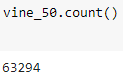
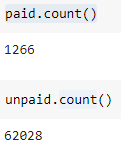
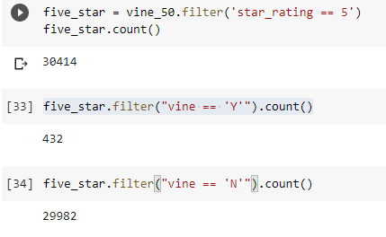
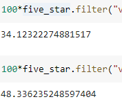
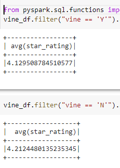

# Challenge 16
## Overview
For this challenge we connected to a AWS RDS instance and managed to collect process the information and publish it to a public data base.

## Results

Total amount of reviews

amount of paid and unpaid reviews

Amount of 5 star reviews by paid and unpaid.

Percetaje of 5 star reviews of paid and unpaid customers

## Conclusion
As we can see, paid customermers actually rate the products with less 5-star reviews than unpaid ones.

We also calculates the average star rtaing for both paid and unpaid customers and it shows that although the paid customers tend to leave less 5 star reviews, the average rating stays almost identical

